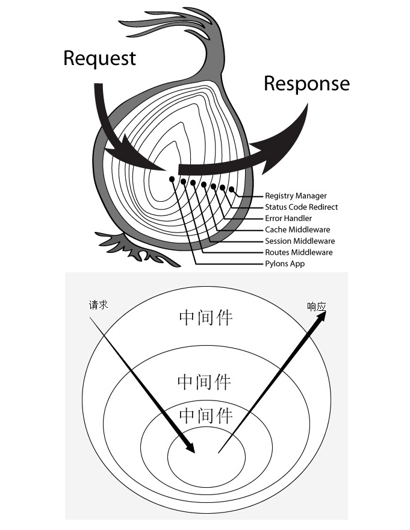

# koa框架

## 安装

```bash
npm init -y

npm i koa
```

## 创建服务器

```js
const koa = require('koa')

const app = new koa()

const main = (ctx) => {
    // ctx 上下文
     console.log(ctx)
    // 设置content-type
  	ctx.response.type = 'html'
    // 设置响应体
  	ctx.response.body = '<a href="https://www.baidu.com">链接</a>'
}

app.use(main)
app.listen(8001)
```

### ctx上下文

>包含当前请求相关的信息: 
>
>**request**: method、url、header
>
>**response**：status、message、header
>
>**app**、**req**、**res**、**originalUrl**、**socket**

```js
{
  request: {
    method: 'GET',
    url: '/favicon.ico',
    header: {
      host: 'localhost:8001',
      connection: 'keep-alive',
      pragma: 'no-cache',
      'cache-control': 'no-cache',
      'sec-ch-ua': '" Not A;Brand";v="99", "Chromium";v="96", "Google Chrome";v="96"',
      'sec-ch-ua-mobile': '?0',
      'user-agent': 'Mozilla/5.0 (Windows NT 10.0; Win64; x64) AppleWebKit/537.36 (KHTML, like Gecko) Chrome/96.0.4664.45 Safari/537.36',
      'sec-ch-ua-platform': '"Windows"',
      accept: 'image/avif,image/webp,image/apng,image/svg+xml,image/*,*/*;q=0.8',
      'sec-fetch-site': 'same-origin',
      'sec-fetch-mode': 'no-cors',
      'sec-fetch-dest': 'image',
      referer: 'http://localhost:8001/',
      'accept-encoding': 'gzip, deflate, br',
      'accept-language': 'zh-CN,zh;q=0.9,en-US;q=0.8,en;q=0.7'
    }
  },
  response: {
    status: 404,
    message: 'Not Found',
    header: [Object: null prototype] {}
  },
  app: { subdomainOffset: 2, proxy: false, env: 'development' },
  originalUrl: '/favicon.ico',
  req: '<original node req>',
  res: '<original node res>',
  socket: '<original node socket>'
}
```

##  koa-route模块

上述main就是一个路由, 但是原生路由不是很方便, 推荐使用koa-route模块

```bash
npm i koa-route
```

```js
const route = require('koa-route')

// 路由处理函数
const main = (ctx) => {
	ctx.response.body = 'hello world'
}

app.use(route.get('/', main))
```

## 静态资源处理

如果网站提供静态资源（图片、字体、样式表、脚本......）。可使用[`koa-static`](https://www.npmjs.com/package/koa-static)模块。无需再额外适配路由

```js
// app.js: E:\Nodejs-koa\app\app.js
// 静态资源目录: E:\Nodejs-koa\resources\images\haha.img

// app.js
const path = require('path');
const serve = require('koa-static');

// 参数一: 当前静态文件的工作目录
const main = serve(path.join(__dirname, '..', 'resources/images'));
app.use(main);

// 直接访问: http://localhost:8001/haha.gif
```

## 重定向

有些场合，服务器需要重定向（redirect）访问请求。比如，用户登陆以后，将他重定向到登陆前的页面。`ctx.response.redirect()`方法可以发出一个302跳转，将用户导向另一个路由。

```js
const redirect = ctx => {
  ctx.response.redirect('/');
  ctx.response.body = '<a href="/">Index Page</a>';
};

app.use(route.get('/redirect', redirect));
```

## 中间件

### 1.logger

Koa 的最大特色，也是最重要的一个设计，就是中间件（middleware）。为了理解中间件，我们先看一下 Logger （打印日志）功能的实现。

最简单的写法就是在`main`函数里面增加一行。

```js
const main = ctx => {
  console.log(`${Date.now()} ${ctx.request.method} ${ctx.request.url}`);
  ctx.response.body = 'Hello World';
};
```

### 2. 中间件的概念

上一个例子里面的 Logger 功能，可以拆分成一个独立函数。

```js
const logger = (ctx, next) => {
  console.log(`${Date.now()} ${ctx.request.method} ${ctx.request.url}`);
  next();
}
app.use(logger);
```

### 3.中间件执行顺序

```js
const one = (ctx, next) => {
  console.log('>> one');
  next();
  console.log('<< one');
}

const two = (ctx, next) => {
  console.log('>> two');
  next(); 
  console.log('<< two');
}

const three = (ctx, next) => {
  console.log('>> three');
  next();
  console.log('<< three');
}

app.use(one);
app.use(two);
app.use(three);
```

结果如下：

```shell
>> one
>> two
>> three
<< three
<< two
<< one
```

> **next()方法**: 其实就是指, 当前执行函数的下一个use里面的方法。

**洋葱模型**

其实就是想向我们表达，调用next的时候，中间件的代码执行顺序是什么。



### 4.异步中间件

迄今为止，所有例子的中间件都是同步的，不包含异步操作。**如果有异步操作（比如读取数据库），那么此中间件以及之上的所有中间件就必须都写成 [async 函数](http://es6.ruanyifeng.com/#docs/async)**。请看

```js
const fs = require('fs.promised');
const Koa = require('koa');
const app = new Koa();

// 第二个main1是异步, 所以第一个main0也要是async函数, 才能确保是洋葱模型的顺序
const main0 = async function(ctx, next) {
    console.log('stpe1')
    await next()
}

const main1 = async function (ctx, next) {
  ctx.response.type = 'html';
  ctx.response.body = await fs.readFile('./demos/template.html', 'utf8');
};

app.use(main0);
app.use(main1);
app.listen(3000);
```

### 5. 中间件的合成

[`koa-compose`](https://www.npmjs.com/package/koa-compose)模块可以将多个中间件合成为一个。

```js
const compose = require('koa-compose');

const logger = (ctx, next) => {
  console.log(`${Date.now()} ${ctx.request.method} ${ctx.request.url}`);
  next();
}

const main = ctx => {
  ctx.response.body = 'Hello World';
};

const middlewares = compose([logger, main]);
app.use(middlewares);
```

#### compose简单介绍

```js
var greeting = (firstName, lastName) => 'hello, ' + firstName + ' ' + lastName
var toUpper = str => str.toUpperCase()
var fn = compose(toUpper, greeting)
console.log(fn('jack', 'smith'))   // Hello Jack Smith
```

- `compose`的参数是函数，返回的也是一个函数
- 因为除了第一个函数的接受参数，其他函数的接受参数都是上一个函数的返回值，所以初始函数的参数是`多元`的，而其他函数的接受值是`一元`的
- `compsoe`函数可以接受任意的参数，所有的参数都是函数，且执行方向是`自右向左`的，初始函数一定放到参数的`最右面`

> 参考链接： https://segmentfault.com/a/1190000008394749

## 错误处理

### 1. 抛错方式一

如果代码运行过程中发生错误，我们需要把错误信息返回给用户。HTTP 协定约定这时要返回500状态码。Koa 提供了`ctx.throw()`方法，用来抛出错误，`ctx.throw(500)`就是抛出500错误。

```js
const main = ctx => {
  ctx.throw(500);
};
```

### 2.抛错方式二

```js
const main = ctx => {
  ctx.response.status = 404;
  ctx.response.body = 'Page Not Found';
};
```

### 3.自定义错误处理中间件

为了方便处理错误，最好使用`try...catch`将其捕获。但是，为每个中间件都写`try...catch`太麻烦，我们可以让最外层的中间件，负责所有中间件的错误处理。

```js
// app/middleware/error-handler.js

// 这种包装可以在调用的时候 在最外层传递一些其他的参数
module.exports = () => {
  return async function (ctx, next) {
      try {
        await next();
      } catch (err) {
        ctx.response.status = err.statusCode || err.status || 500;
        ctx.response.body = {
          message: err.message
        };
      }
  }
}

// app/app.js
const errorHandler = require('./middleware/error-handler')

app.use(errorHandler());
app.use(() => {
  ctx.throw(500);
});
```

### 4. error事件监听

运行过程中一旦出错，Koa 会触发一个`error`事件。监听这个事件，也可以处理错误。

```js
const main = ctx => {
  ctx.throw(500);
};

// 可以注册 koa自带的error事件
app.on('error', (err, ctx) =>
  console.error('server error', err);
);
```

### 5. 释放error事件

需要注意的是，如果错误被`try...catch`捕获，就无法再触发`error`事件。但是我们可以在错误事件处理函数中调用`ctx.app.emit()`，手动释放`error`事件，使监听函数生效。

```js
const handler = async (ctx, next) => {
  try {
    await next();
  } catch (err) {
    ctx.response.status = err.statusCode || err.status || 500;
    ctx.response.type = 'html';
    ctx.response.body = '<p>Something wrong, please contact administrator.</p>';
    // 可以手动释放error事件, 将err传递进去
    ctx.app.emit('error', err, ctx);
  }
};

const main = ctx => {
  ctx.throw(500);
};


app.on('error', function(err) {
  console.log('logging error ', err.message);
  console.log(err);
});

```

> 说明app是继承自nodejs的EventEmitter对象。
>
> 参考链接：https://www.runoob.com/nodejs/nodejs-event.html

## 处理POST请求

### 1.通过ctx.req处理

Web 应用离不开处理表单。本质上，表单就是 POST 方法发送到服务器的键值对。

```js
const main = (ctx) => {
    let dataArr = [];
    // 注册data事件 获取Buffer数据流
    ctx.req.addListener('data', (data) => {
        dataArr.push(data);
    });
    // 存储完成后合并
    ctx.req.addListener('end', () => {
        let data = Buffer.concat(dataArr).toString();
        console.log(data)
    });
    ctx.response.body = 'hello world';
}

app.use(route.post('/post', main));  //  1. 路径 2. ctx函数
```

### 2.通过koa-body处理

```js
const Koa = require('koa');
const app = new Koa();
const router = require('koa-router')();
const koaBody = require('koa-body');
 
router.post(
  '/users',
  koaBody(), // 路由独享中间件
  (ctx) => {
    console.log(ctx.request.body); // koa-body已处理好, 直接在request.body中获取
    // => POST body
    ctx.body = JSON.stringify(ctx.request.body);
  }
);
 
app.use(router.routes());

app.listen(3000);
```

### 3.文件上传

```js
// 文件上传
const os = require('os');
const fs = require('fs');

const uploader = route.post('/upload', (ctx) => {
  const tmpdir = os.tmpdir(); // 创建系统临时目录
  const filePaths = []; // 最终生成文件的地址
  const files = ctx.request.files || {}; // koa-body会自动处理并挂载到它自己定义的一个目录

  // 文件是分段传输的
  for (let key in files) {
    const file = files[key];
    const filePath = path.join(tmpdir, file.name); // 生成我们自己制定的目录
    const reader = fs.createReadStream(file.path); // 读取文件, 并且把它存在一个变量中
    const writer = fs.createWriteStream(filePath); // 定义写入函数. 写入到我们指定的目录
    reader.pipe(writer); // 真正的去执行读写的过程
    filePaths.push(filePath);
  }
  ctx.body = filePaths;
})

// app.js
const koaBody = require('koa-body');
app.use(koaBody({ multipart: true }));  // 代表我们上传的是文件
```